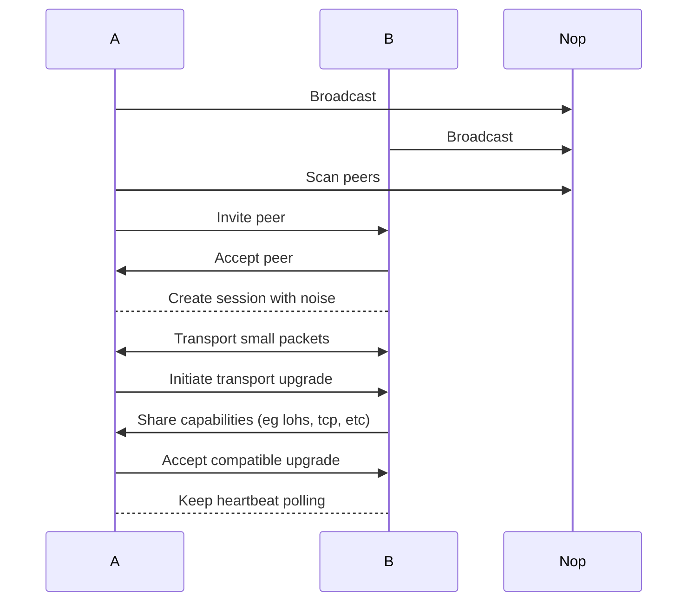

### A proximity based rendezvous mechanism
## BTLE layer
A rough spec will suffice here. The idea is to give a basic trait structure that demonstrate the capabilities of the btle transport mostly as a unification discovery layer. The structure can be structured as
```
module btle_layer:
	exposed_fns:
		- broadcast_self
		- scan_peers
		- invite_peer
		- accept_peer
		- negotiate_higher_transport
	private_elements:
		- sessions (stable connection elements)
		- recognized_peers (scoring & blacklist)
		- peer_identity
		- capabilities (for upgrade negotiation)
```
- [x] The core of this layer is the capabilities element required, this enables the negotiation of a faster transport for both nodes. Also, the btle session should be kept as a fallback.
 
> Note, btle already provides traffic session authentication, however, `noise` will still be applied to keep a unison of all libp2p transports.

Issues to keep note and study include the max size for `btle advertisment` which is around `31bytes`. 
## Flow

## Transport distinction
This brings us to what can be upgraded. The types of transport that can be upgraded. 
I'll classify all transport to two
1. Short range & LAN
2. Online 
By default, all mentioned capabilities should be short range & lan. However, we can include a single identifier showing the device supports online transports hence the btle connection can be canceled if both devices support it. 