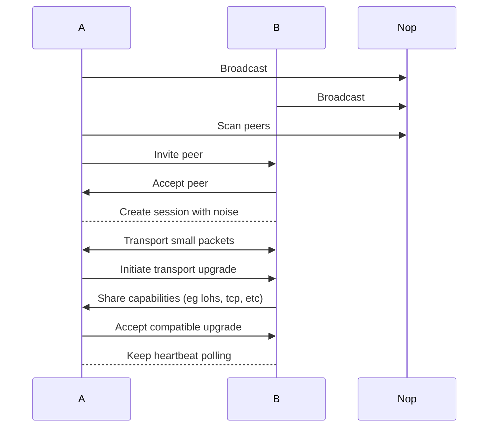

[Still draft] 

History has done justice to how the blockchain brought about financial freedom to the people. Can we get fair payment, can we have a coordination system without trust, settlement? We've seen the scalability trilemma in play and how we have a lot till the eventual end goal.   \
Light clients are necessary to have a fully decentralized and free system and this is properly illustrated [here](https://ethereum.org/developers/docs/nodes-and-clients/light-clients/).   \
This in turn needs trustless verification and the [portal network](https://inevitableeth.com/ethereum/light-clients). This is an independent network of computers (which are of all forms from a tiny microcontroller in your watch to your high tech super computers) that serve multiple interdependent functionalities and data. Light clients will query the portal network for proofs, mempools in order to participate in verification. \
When we look forward at the future direction of ethereum for example, we can see from https://strawmap.org/ how the entire system is shifting towards heavy (sort of) proof generation but light and quick verification. This in fact enables a layer of light clients where even if we have just a single high performance proving machine(Gigagas L1 with ZKPs), the blockchain is safe with the decentralized upholders who don't have to rerun the heavy computations - trustless verification needed for light clients. 
However, one major element here is that compute & data storage required for running a node drops heavily till the point smartphones, watches and probably your smart freezer can participate in a decentralized future. It'll be a major loss if these microcontrollers and other edge devices that can participate in this (due to compute and data scale) can't due to network limitation. 

There's a major problem however, the need for a highly efficient network layer.  \
Light clients on mobile or other IoT devices sit behind restrictive NATs or the intermittent connectivity hell. BTLE enables devices to form an opportunistic mesh network which allows sharing verified block headers and proof without needing constant, heavy high speed internet connection. A full research discusses and references this point [here](https://www.mdpi.com/1424-8220/25/4/1190). 

If the future is heavy proof generation but fast verification, the network layer must match that efficiency. BTLE is designed for ultra low power and small data bursts which aligns with the lean nature of light client updates (eg the [96 bytes BLS signature used in sync committees](https://eth2book.info/capella/part2/building_blocks/signatures/)).  \
[Todo: Experiment showing either ns3 or cisco packet tracer nodes for sync committees]

Another major advantage is the resilience of this layer. As libp2p already has highly modular transports, the consensus layer becomes more rigid as verification is on a diverse range of physical transport layers. This makes it harder to censor the decentralized system at network level. In fact, maybe we can survive a full internet shut down. 

Yes, maybe BTLE has been over praised, can it really handle any of the problems mentioned? I'll consider some of the core issues with btle and a few suggestions.

Firstly, we have to discuss the bandwidth constraints. BTLE is designed for small bursts of data (Kb/s). A ZKP might be small, modern post quantum signatures and large batches of DAS samples can exceed the BTE's comfortable throughput hence high latency.    \
Also, the Max Transmission Units (MTU) limits. BTLE has a very small default packet size. Segmenting larger blockchain messages into dozens of packets increases the risk of packet loss and retransmission delays.   \
Another problem is the range and density of btle nodes. A pure btle network would require an extremely high density of peers to ensure a message can propagate across a city or region. A simple observation to this though is that almost all devices on earth support btle. It's even a requirement for several devices. Hence, we can easily get a highly dense network.

This however still leads to "islanding" where groups of peers are cut off from the main network.   \
Another issue to this is the connection limits as most mobile hardware can only maintain a few active BTLE connections simultaneously which limits the gossip efficiency compared to traditional TCP/UDP based p2p networks.

However, there are a few solutions to these problems.   \
Starting with, I suggest an upgrade logic where BTLE serves as a background mesh but also initiates network upgrade. Hence, btle serves as a resilient mesh network but also a discovery layer. 
```
module btle_layer:
	exposed_fns:
		- broadcast_self
		- scan_peers
		- invite_peer
		- accept_peer
		- negotiate_higher_transport
	private_elements:
		- sessions (stable connection elements)
		- recognized_peers (scoring & blacklist)
		- peer_identity
		- capabilities (for upgrade negotiation)
```



For the discovery layer, an implementation was made to experiment with this idea. The demo video below shows the flow between a macbook pro(left) and a mac mini(right) in proximity (view via ssh on mini). It demonstrate the way the two nodes discover each other by order of proximity, connect and exchange their peer ids. 
![[discovery-peer-id-exchange.mov]]
The implementation for this can be found [https://github.com/xpanvictor/btle-libp2p-research/tree/main/ble-network-upgrade](https://github.com/xpanvictor/btle-libp2p-research/tree/main/ble-network-upgrade).

[Also discuss how btle is the only bridge between ios and android as developed and discovered by Berty Technologies.]\
Berty runs IPFS successfully on mobile devices to decentralize data storage and routing. 

References: 
1. Experiments repo [https://github.com/xpanvictor/btle-libp2p-research](https://github.com/xpanvictor/btle-libp2p-research).